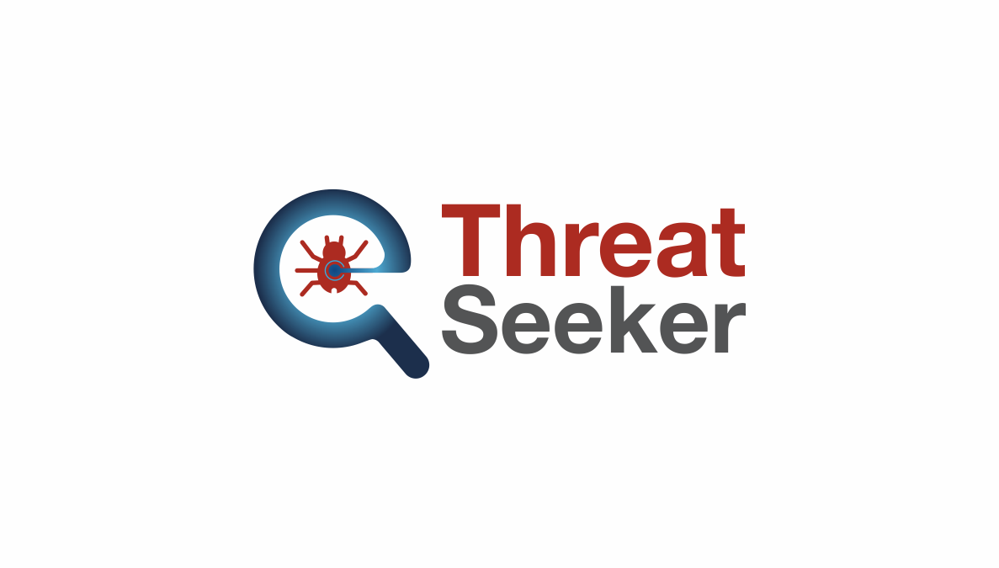
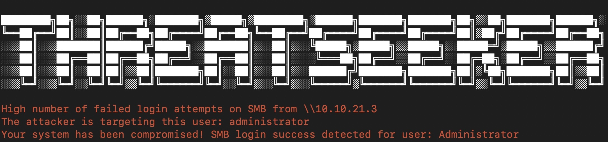
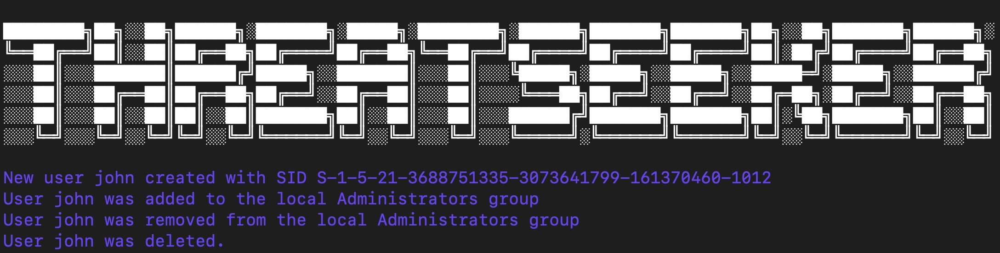
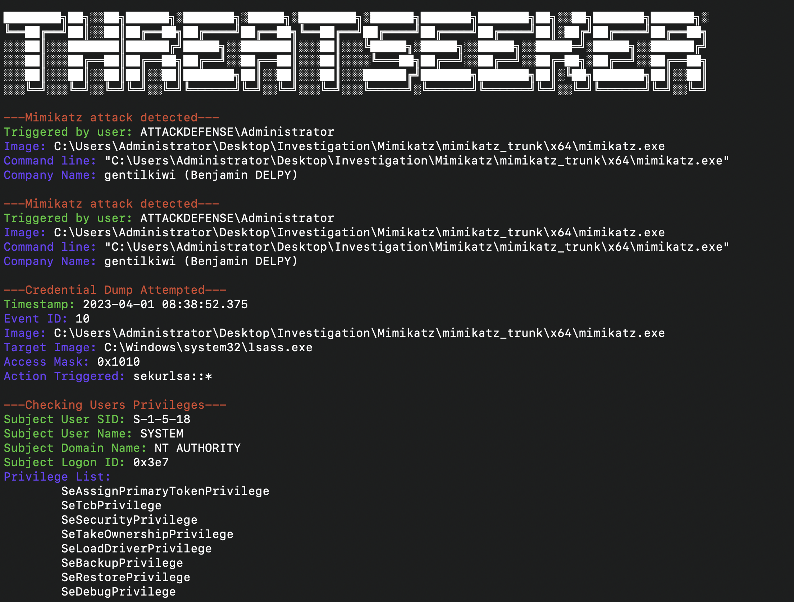
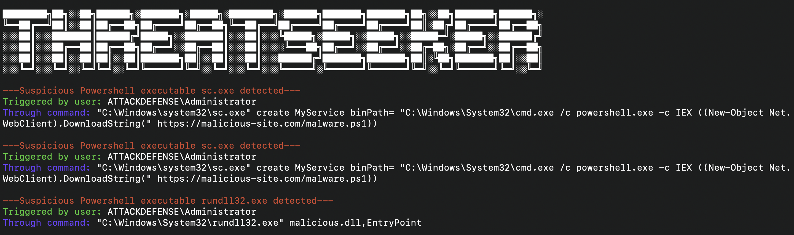
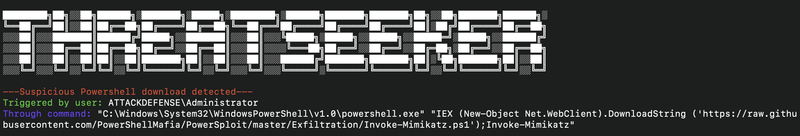

# ThreatSeeker



## Threat Hunting via Windows Event Logs

Threat hunting using Windows logs is essential for identifying and mitigating potential security threats within an organization's network. It can be a time-consuming and painstaking process due to a large amount of data that needs to be collected and analyzed. The threat-hunting process could be repetitive. However, this process can be improved through custom scripts and tools.

We will introduce ThreatSeeker, a windows log analysis framework that allows a threat hunter to find the common threats on the machine quickly. This tool also helps a threat hunter to detect APT movements. 

## ThreatSeeker will allow a user to detect the following attacks:

- Suspicious account behavior
- User Creation and Added/Removed User to Admin group
- Brute Force Attack Detection on SMB, RDP, WinRM, etc.
- Brute Force Attack Detection
- Detection of malicious executable
- Detection of PTH Attack
- Suspicious service creation
- Installed Service with the executable in Suspicious locations
- Detection of Modifying, Starting, Disabling, and Stopping Service
- Detection of special privileges assigned
- Suspicious Command Auditing
- Powershell with Suspicious Argument
- PowerShell Downloads
- Execution of Suspicious executable, i.e., rundll32.exe, sc.exe, mshta.exe, wscript.exe, cscript.exe
- Suspicious Windows Registry Modification, Addition
- Many More...

## Installation

```
git clone git@github.com:ine-labs/ThreatSeeker.git
cd ThreatSeeker
pip install -r requirements.txt
```

# Contributors

Ashish Bhangale, Sr. Security Researcher, Lab Platform, INE <abhangale@ine.com>

Arafat Ansari, Software Engineer (Security), Lab Platform, INE  <aansari@ine.com>

G Khartheesvar, Software Engineer (Security), Lab Platform, INE <gkhartheesvar@ine.com>

# Screenshots

## SMB Brute Force Detection



## Suspicious account behavior



## Detection of malicious executable



## Execution of Suspicious executable



## Suspicious Downloads



### Developed with :heart: by [INE](https://ine.com/) 

# License

This program is free software: you can redistribute it and/or modify it under the terms of the MIT License.

You should have received a copy of the MIT License along with this program. If not, see https://opensource.org/licenses/MIT.
